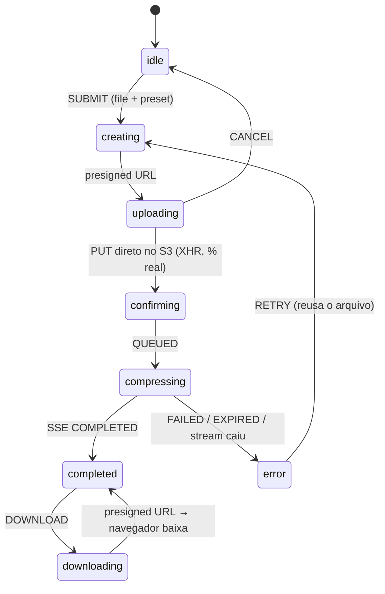

# Squish Web

> Frontend do **Squish**, compressor de vídeo na nuvem: upload direto pro object storage via presigned URL, status em tempo real por SSE e download do resultado.

[](https://github.com/vitozaap/saturn-web/commits)
[](https://www.typescriptlang.org/)
[](https://nextjs.org/)
[](https://react.dev/)

O sistema é dividido em três repositórios que se comunicam apenas por contratos:

| Repo | O que faz |
|------|-----------|
| **saturn-web** (este) | UI: upload, acompanhamento em tempo real, resultado e histórico |
| [saturn-api](https://github.com/vitozaap/saturn-api) | Control plane: auth, presigned URLs, ciclo de vida, SSE |
| [saturn-compression-worker](https://github.com/vitozaap/saturn-compression-worker) | Consome a fila, roda ffmpeg, devolve o resultado |

## O fluxo de compressão

O coração do app é uma **máquina de estados XState v5** ([`components/compress/upload/uploader/machine/`](components/compress/upload/uploader/machine/README.md), com README próprio detalhando cada decisão):



**Por que uma máquina e não `isLoading`:** o fluxo tem regras que booleanos não expressam — cancelar só existe durante o upload (transição que só existe em `uploading`), a barra de progresso é real no upload e indeterminada na compressão, e todo recurso assíncrono (XHR, `EventSource`) morre sozinho ao sair do estado que o invocou, sem limpeza manual.

**Pontos do fluxo:**

- **Upload direto pro storage** — o vídeo nunca passa pelo Next; a API só emite a presigned URL. O PUT usa `XMLHttpRequest` porque só `xhr.upload.onprogress` reporta progresso real de upload (fetch não tem).
- **Status em tempo real sem polling** — `EventSource` no stream SSE da API. O sub-estado `reconnecting` dá teto de 15s à reconexão automática do navegador (que sozinha tentaria pra sempre, calada).
- **Prévia de qualidade simulada** ([`lib/video.ts`](lib/video.ts)) — captura um frame do vídeo local via `<video>` + canvas e re-encoda em JPEG com dano calibrado por preset, mostrando o trade-off antes/depois **antes** do ffmpeg existir.
- **Validação por conteúdo, não extensão** — [`file-type`](https://github.com/sindresorhus/file-type) lê os magic bytes do arquivo num schema zod assíncrono (react-hook-form). Limite de 500 MB.

## API mesma origem

O `next.config.ts` faz **rewrite** de `/api/*` pro backend NestJS: o navegador só fala com o host do web, então o cookie de sessão do better-auth fica first-party e `fetch`/`EventSource` funcionam same-origin — sem CORS e sem base URL no código do cliente.

No servidor é o inverso: Server Components e Server Actions falam **direto** com a API (`lib/api.server.ts`), repassando o cookie manualmente — `credentials: "include"` é no-op em fetch server-side.

## Autenticação

better-auth com **sessão anônima preguiçosa**: `ensureSession()` só cria a sessão no primeiro `POST /compressor` — visitante que não comprime nada não gera row. O histórico exige conta real: `proxy.ts` redireciona sem cookie (checagem otimista), e o Server Component revalida a sessão e rejeita anônimos.

## Tecnologias

| Camada | Stack |
|--------|-------|
| Framework | [Next.js 16](https://nextjs.org/) (App Router, `output: standalone`) |
| UI | React 19 + [React Compiler](https://react.dev/learn/react-compiler) (memoização automática, sem `useMemo`/`useCallback` manuais) |
| Estado do fluxo | [XState v5](https://stately.ai/docs) (`@xstate/react`) |
| Estilo | [Tailwind CSS 4](https://tailwindcss.com/) + [shadcn/ui](https://ui.shadcn.com/) sobre [Base UI](https://base-ui.com/) |
| Autenticação | [better-auth](https://www.better-auth.com/) (client + plugin anonymous) |
| Formulários | [react-hook-form](https://react-hook-form.com/) + [zod 4](https://zod.dev/) (resolver assíncrono) |
| Upload | [react-dropzone](https://react-dropzone.js.org/) + XHR com progresso e `AbortController` |
| Validação de mídia | [file-type](https://github.com/sindresorhus/file-type) (magic bytes no browser) |
| Tema / feedback | [next-themes](https://github.com/pacocoursey/next-themes) (light/dark) + [sonner](https://sonner.emilkowal.ski/) (toasts) |
| Fontes | `next/font`: Bricolage Grotesque (display), Plus Jakarta Sans (corpo), JetBrains Mono (números) |
| Deploy | Docker multi-stage (standalone, roda como `node` sem root) |

A cópia da UI é em **português** (voz do produto: "squish", "espremer"); código e comentários em inglês.

## Páginas

| Rota | Tipo | O que faz |
|------|------|-----------|
| `/` | Landing | Hero + dropzone; todo o fluxo de compressão acontece aqui, sem trocar de rota |
| `/login` / `/register` | Auth | Formulários better-auth |
| `/history` | Server Component | Lista as compressões (tabela + cards), download/delete por linha, estado `Expirado` |

O delete do histórico é uma **Server Action** (`app/history/actions.ts`) que chama a API e faz `revalidatePath("/history")` — a linha some sem estado no cliente.

## Rodando localmente

Pré-requisitos: Node 24+, a [saturn-api](https://github.com/vitozaap/saturn-api) rodando (com a infra dela: Postgres, MinIO, Redis).

```bash
# 1. Dependências
npm ci

# 2. Ambiente — .env.development já aponta pra API local
# API_URL="http://localhost:3001"

# 3. Dev server
npm run dev     # http://localhost:3000
```

Outros comandos:

```bash
npm run build   # production build
npm run start   # serve o build
npm run lint    # eslint
```

Com Docker: `docker compose -f compose.dev.yml up` (build multi-stage, imagem standalone).

## Estrutura

```
app/
├── (auth)/            # /login, /register
├── history/           # Server Component + Server Action (delete)
└── page.tsx           # landing com o fluxo de compressão
components/
├── compress/upload/
│   ├── uploader/
│   │   ├── machine/   # máquina XState (README próprio)
│   │   └── *.tsx      # cards por fase: enviando, comprimindo, resultado, erro
│   ├── dropzone.tsx   # react-dropzone + validação
│   └── validation.ts  # schema zod (tamanho + magic bytes)
├── history/           # tabela, cards, ações por linha
├── forms/             # login/register (react-hook-form)
└── ui/                # shadcn
lib/
├── api.ts             # client → rewrites (/api/*)
├── api.server.ts      # server → API direto, cookie manual
├── session.ts         # ensureSession (anônima preguiçosa)
└── video.ts           # captura de frame + simulação de preset
proxy.ts               # guarda otimista de /history
```

## Referências

- [XState v5 — invoked actors e ciclo de vida](https://stately.ai/docs/actors)
- [Server-Sent Events — MDN](https://developer.mozilla.org/en-US/docs/Web/API/Server-sent_events)
- [Next.js — rewrites](https://nextjs.org/docs/app/api-reference/config/next-config-js/rewrites)
- [React Compiler](https://react.dev/learn/react-compiler)
- [better-auth — anonymous plugin](https://www.better-auth.com/docs/plugins/anonymous)
- [Presigned URLs — AWS S3](https://docs.aws.amazon.com/AmazonS3/latest/userguide/PresignedUrlUploadObject.html)
